# tp1 :  PASSIVE attack  

* by **Firdawse GUERBOUZI**  and **Meryem BADAOUI** from **AI** major 
  
## Objectifs :
- Implement a simple passive sniffer 
- Handle sniffing software

##  Software tools:
-   Linux, wireshark, compilateur cc ou gcc.  

Before  starting let's introduce some basics  

## What is Sniffing?

[Sniffing](https://www.greycampus.com/blog/information-security/what-is-a-sniffing-attack-and-how-can-you-defend-it)  is a process of monitoring and capturing all data packets passing through given network. Sniffers are used by network/system administrator to monitor and troubleshoot network traffic. Attackers use sniffers to capture data packets containing sensitive information such as password, account information etc. Sniffers can be hardware or software installed in the system.

There are two types of sniffing attack passive and active  but in this practical course we will only focus on the **passive snifffiing**

### So what is a passive sniffing ?

It is the process of sniffing through the hub. Any traffic that is passing through the non-switched or unbridged network segment can be seen by all machines on that segment. Sniffers operate at the data link layer of the network. Any data sent across the LAN is actually sent to each and every machine connected to the LAN. This is called passive since sniffers placed by the attackers passively wait for the data to be sent and capture them.


## Part 1 : (under UBUNTU)

- Compile (cc -c sniffer_eth_ip_tcp_data.c) the source code and generate the executable (cc sniffer_eth_ip_tcp_data.c - o sniffer).
``` c++
cc -c sniffer_eth_ip_tcp_data.c
```
* _generate the executable_

```
cc sniffer_eth_ip_tcp_data.c -o sniffer
```

-    Run (in root mode: "sudo command" under ubuntu) the sniffer ** / sniffer eth0 100 ** to sniff the first 100 frames received on the eth0 interface

```
sudo ./sniffer eth0 100
```


-   In the previous manipulation, the frames are displayed in hexadecimal format. To display the content of the ETHERNET header, you must remove the comment from the ParseEthernetHeader function, recompile, regenerate the executable and redo step 2).

     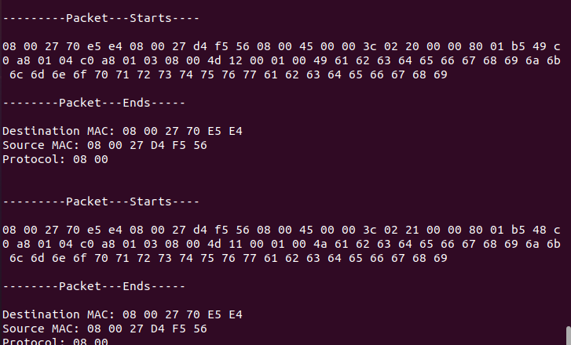

- To display the content of the headers of higher-level protocols, remove the comments from the corresponding functions (at the level of the main function), recompile, regenerate the executable and run the sniffer again. Consider doing a TCP traffic exchange (for example using the vsftpd server or connecting to the Internet).
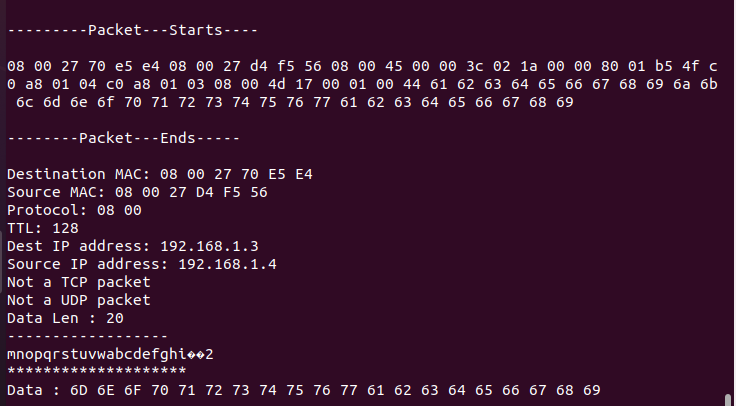  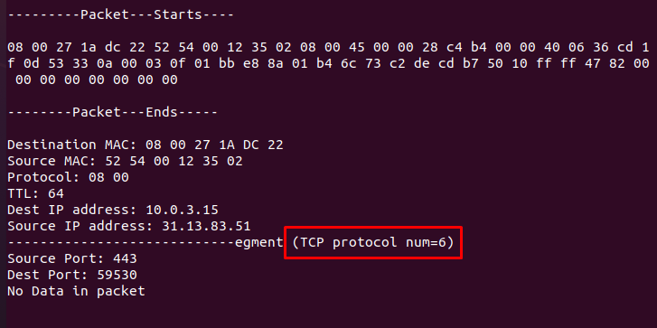

-   remove the comments from the UDP  function to display the  UDP header 

    
    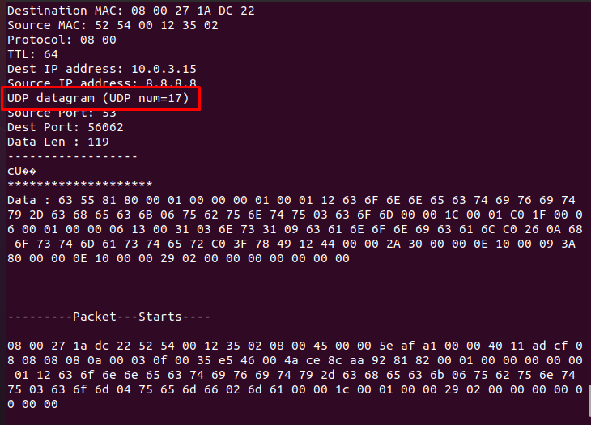

## Part 2 : manipulation of sniffers

In this part, we are interested in the manipulation of some existing sniffers.

-  we  start the **wireshark** software in the background (wireshark &) and start the capture on the ETHERNET or wireless interface.

     [](https://user-images.githubusercontent.com/85891554/146661794-390beed0-1f59-402e-bb7c-0d4320299593.png)

- we start traffic exchange applications between other machines and ours. then observe the captured packets
[

- Can we capture the traffic exchanged between machines in the rest of the network?
    -   **NO** Because wireshark can sniff on broadcast trafic only , so if we didn't compromize the network and impersonate the gateway we can't sniff on unicast packets
      -   for example: an icmp packet sent from B to C is unicast so it can not be detected by our machine A    

</br>

   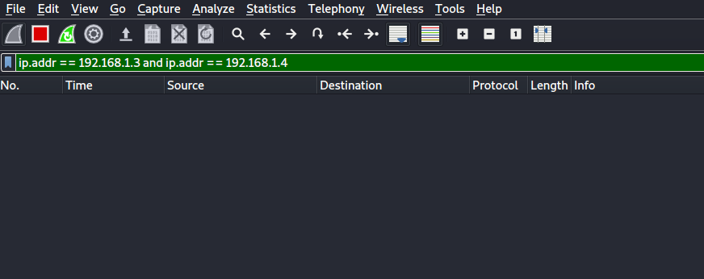

-   **Now** , we Configure wireshark filter   

    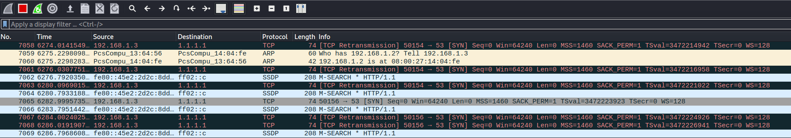
    **to  Only**
    -  display frames relating to a particular protocol: bootp, tcp, icmp, etc.  

       * tcp 
      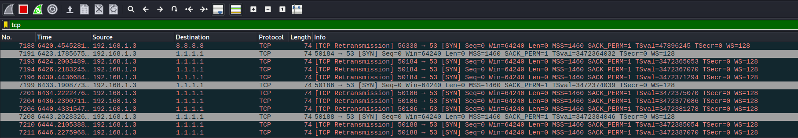
       * Icmp
      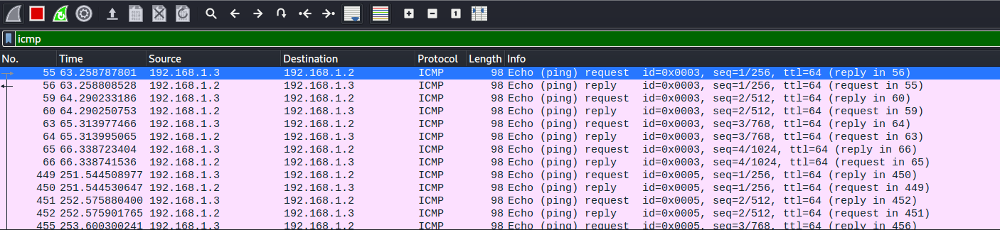
       * Dns
      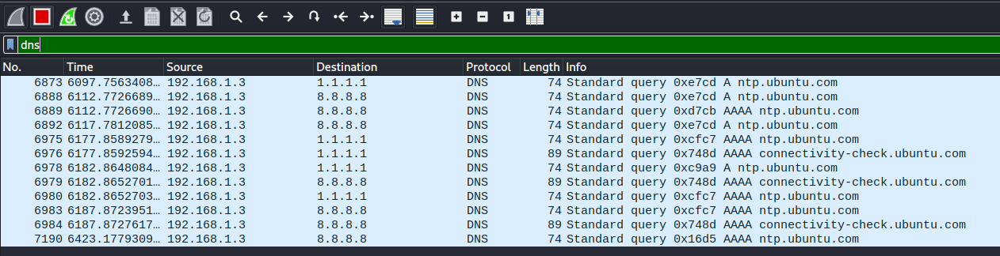

    

    
    - display only the frames whose destination MAC address is that of your machine  
    </br>

    
    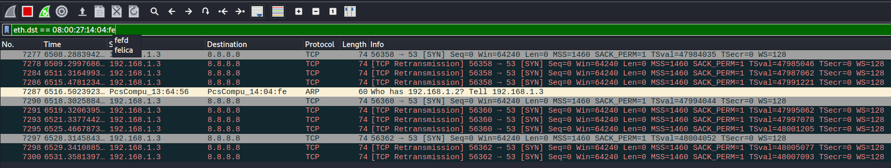
    
    -   display only the frames exchanged between two machines with address @ IP1 and @ IP2  
     </br>
    
    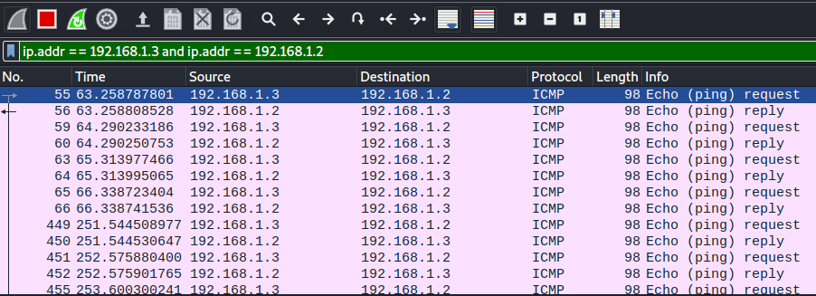

    
    -only display frames whose size is greater than a given size 
     </br>
    
    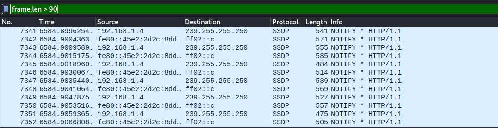
    ## Part 3 : remote sniffing
    In order to do this part we need 2 windows machines connected to different networks:  
    
* first,we need to install winpcap to get and start the rpcap(remote packet capture protocol) service on machine A:
  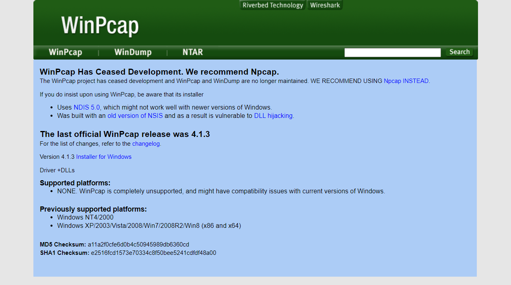  

  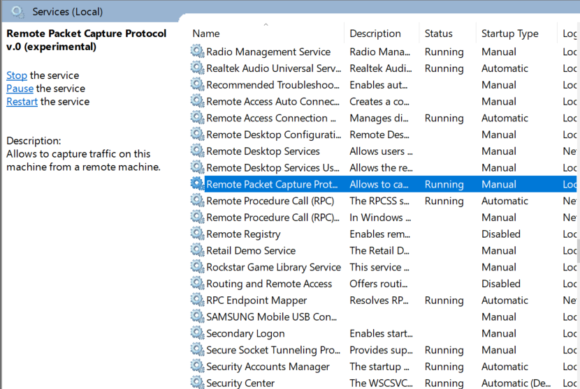
* then install wireshark to machine B, go to manage interfaces->remote interfaces, and then add our machine A:  
    
    

     PS: this won't work if we dont enable rpcap service in the firewall.
        
  
        
* now we just observe the packets:
      
   

